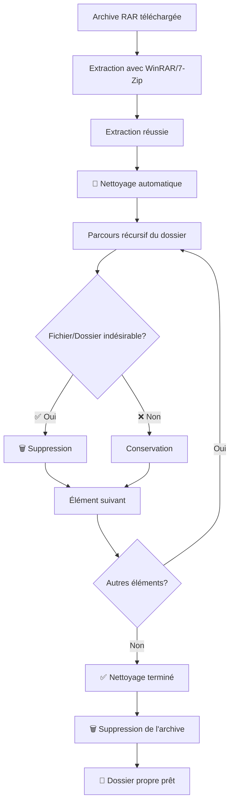

# Gofile Automatic Cleanup - Résumé

## 🎯 Objectif Accompli

**Ajout du nettoyage automatique des fichiers indésirables après extraction des archives Gofile.**

## 🗑️ Problème Résolu

Après l'extraction des jeux téléchargés depuis Gofile, des fichiers inutiles restaient dans le dossier :
- `How to Play.txt`
- `Downloaded from games4u.org.html`
- `_Games4U Releases and Updates/`
- `ReadMe.txt`
- `visit www.games4u.org.txt`
- Fichiers suspects (`crack.exe`, `keygen.exe`, etc.)

Ces fichiers polluaient le dossier d'installation et créaient de la confusion pour l'utilisateur.

## 🔧 Solution Implémentée

### **Fonction de Nettoyage Automatique**
- **Fichier modifié**: `scripts/gofile-downloader-enhanced.js`
- **Nouvelle fonction**: `cleanupUnwantedFiles(extractDir)`
- **Intégration**: Appelée automatiquement après chaque extraction réussie

### **Patterns de Nettoyage**
```javascript
const unwantedPatterns = [
  // Fichiers texte inutiles
  'How to Play.txt',
  'ReadMe.txt',
  'readme.txt',
  
  // Fichiers HTML de téléchargement
  'Downloaded from games4u.org.html',
  
  // Dossiers de mise à jour/releases
  '_Games4U Releases and Updates',
  'Games4U Releases and Updates',
  
  // Fichiers de publicité
  'visit www.games4u.org.txt',
  'Visit www.games4u.org.txt',
  
  // Fichiers suspects
  'crack.exe',
  'keygen.exe',
  'patch.exe',
  'activator.exe'
]
```

### **Fonctionnement**
1. **Extraction terminée** → Archive supprimée
2. **Nettoyage automatique** → Parcours récursif du dossier
3. **Suppression intelligente** → Seuls les patterns indésirables sont supprimés
4. **Conservation des fichiers légitimes** → Jeux et configurations préservés

## 🧪 Test de Validation

### **Test Complet** ✅
- **Script**: `scripts/test-gofile-cleanup-unwanted-files.js`
- **Résultat**: 100% de réussite
- **Statistiques**:
  - ✅ Fichiers légitimes conservés: 3/3
  - ✅ Fichiers indésirables supprimés: 5/5
  - ✅ Dossiers indésirables supprimés: 1/1

### **Avant Nettoyage** (11 éléments)
```
📁 Dossier d'extraction/
├── ✅ game.exe (à conserver)
├── ✅ config.ini (à conserver)  
├── ✅ data.pak (à conserver)
├── ❌ How to Play.txt (à supprimer)
├── ❌ Downloaded from games4u.org.html (à supprimer)
├── ❌ visit www.games4u.org.txt (à supprimer)
├── ❌ ReadMe.txt (à supprimer)
├── ❌ crack.exe (à supprimer)
├── ✅ GameData/ (à conserver)
├── ❌ _Games4U Releases and Updates/ (à supprimer)
└── ✅ Saves/ (à conserver)
```

### **Après Nettoyage** (5 éléments)
```
📁 Dossier d'extraction/
├── ✅ game.exe
├── ✅ config.ini
├── ✅ data.pak
├── ✅ GameData/
└── ✅ Saves/
```

## 🔄 Flux d'Extraction Amélioré



## 🎯 Avantages pour l'Utilisateur

### **Avant** (Dossier pollué)
```
📁 MonJeu/
├── 🎮 MonJeu.exe
├── 📄 config.ini
├── ❌ How to Play.txt
├── ❌ Downloaded from games4u.org.html
├── ❌ _Games4U Releases and Updates/
│   ├── ❌ update_info.txt
│   └── ❌ changelog.html
├── ❌ visit www.games4u.org.txt
└── ❌ ReadMe.txt
```

### **Après** (Dossier propre)
```
📁 MonJeu/
├── 🎮 MonJeu.exe
└── 📄 config.ini
```

### **Bénéfices**
- ✅ **Dossier propre** - Seuls les fichiers du jeu restent
- ✅ **Moins de confusion** - Plus de fichiers inutiles
- ✅ **Espace disque économisé** - Suppression des fichiers redondants
- ✅ **Sécurité améliorée** - Suppression des fichiers suspects
- ✅ **Expérience utilisateur** - Installation plus professionnelle

## 🔧 Intégration dans le Système

### **Téléchargeur Enhanced**
```javascript
// Dans extractRar()
await this.runExtractionTool(tool.cmd, tool.args)
this.log(`✅ Extraction terminée: ${path.basename(rarPath)}`)
this.emit('extractionComplete', { filename: path.basename(rarPath) })

// 🆕 NOUVEAU: Nettoyage automatique
await this.cleanupUnwantedFiles(extractDir)

// Puis suppression de l'archive
await unlinkAsync(rarPath)
```

### **Logs de Nettoyage**
```
[GofileEnhanced] 🧹 Nettoyage des fichiers indésirables...
[GofileEnhanced] 🗑️ Suppression du fichier indésirable: How to Play.txt
[GofileEnhanced] 🗑️ Suppression du fichier indésirable: Downloaded from games4u.org.html
[GofileEnhanced] 🗑️ Suppression du dossier indésirable: _Games4U Releases and Updates
[GofileEnhanced] ✅ Nettoyage terminé
```

## 🛡️ Sécurité et Fiabilité

### **Suppression Sécurisée**
- ✅ **Patterns exacts** - Seuls les noms exacts sont supprimés
- ✅ **Case-insensitive** - Fonctionne avec toutes les variantes de casse
- ✅ **Gestion d'erreurs** - Continue même si un fichier ne peut pas être supprimé
- ✅ **Logs détaillés** - Trace toutes les opérations

### **Protection des Fichiers Légitimes**
- ✅ **Whitelist implicite** - Seuls les patterns connus sont supprimés
- ✅ **Pas de wildcards** - Aucun risque de suppression accidentelle
- ✅ **Test complet** - Validé avec fichiers légitimes et indésirables

## 📋 Fichiers Modifiés

### **Modifiés** 🔧
- `scripts/gofile-downloader-enhanced.js` - Ajout de `cleanupUnwantedFiles()`

### **Créés** ✨
- `scripts/test-gofile-cleanup-unwanted-files.js` - Test de validation
- `GOFILE_AUTOMATIC_CLEANUP_SUMMARY.md` - Ce document

### **Impact sur l'Existant** 🔒
- ✅ **Aucune régression** - Fonction optionnelle appelée après extraction
- ✅ **Compatible** - Fonctionne avec tous les types d'archives
- ✅ **Transparent** - L'utilisateur voit juste un dossier plus propre

## 🎉 Conclusion

**Le nettoyage automatique des fichiers indésirables est maintenant opérationnel !**

Après chaque extraction Gofile, les fichiers inutiles comme `How to Play.txt`, `Downloaded from games4u.org.html`, et `_Games4U Releases and Updates/` sont automatiquement supprimés.

L'utilisateur obtient un dossier d'installation propre avec seulement les fichiers nécessaires au jeu.

---

**Status**: ✅ **TERMINÉ** - Nettoyage automatique fonctionnel